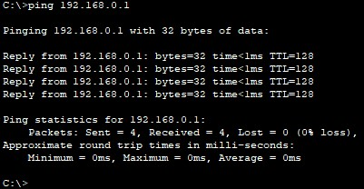

## Урок 1. Основы компьютерных сетей. Ethernet.

> Починить сеть из файла, чтобы все линки были зеленые. Попинговать компьютеры.
>
> — Сдать два скриншота успешного пинга с РС 10.0.0.1 на интерфейс сервера Fa0 10.0.0.5 и на PC 10.0.0.3.
>
> — Сдать один скриншот успешного пинга с РС 192.168.0.3 на интерфейс сервера Fa1 192.168.0.1.

_Чиним сеть:_


_Пингуем с PC 192.168.0.1:_

```
ping 10.0.0.5
```


```
ping 10.0.0.3
```


_Пингуем с PC 192.168.3:_

```
ping 192.168.0.1
```


